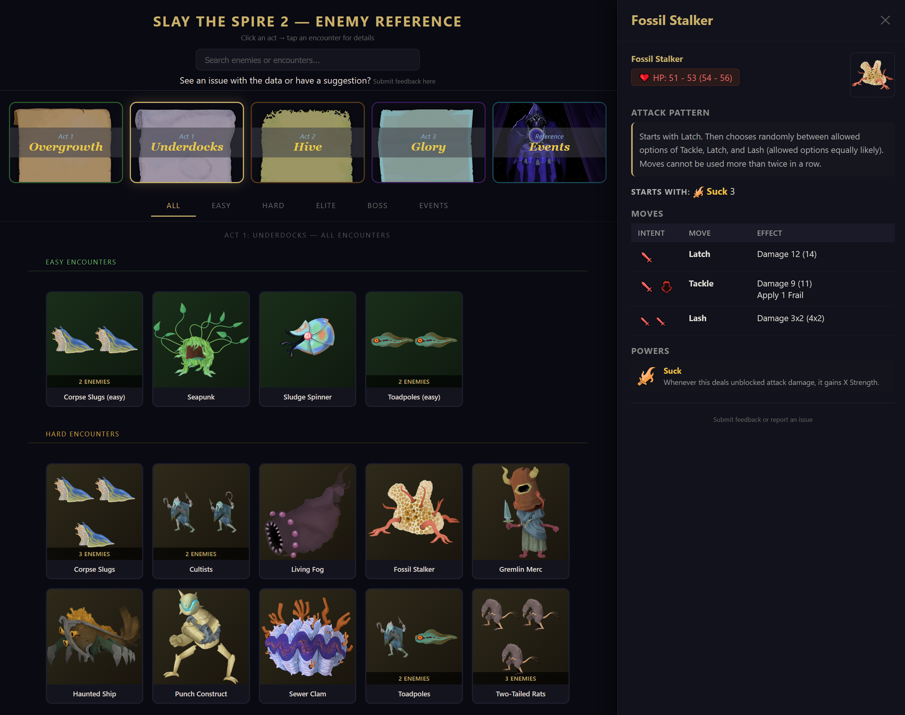
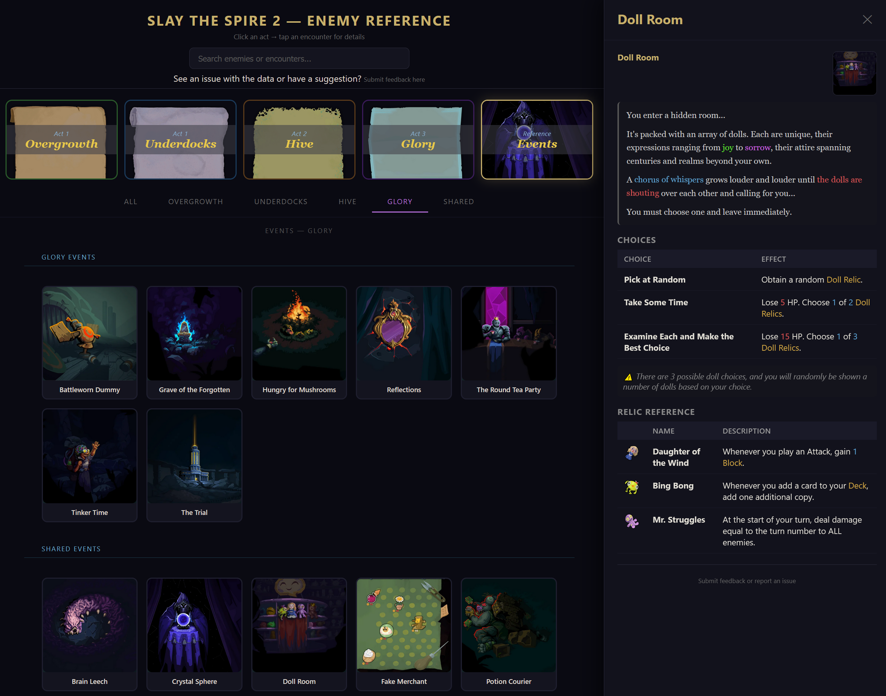

# STS2 Enemy Reference

An unofficial reference guide for **Slay the Spire 2**. Look up enemy attack patterns, event outcomes, and item details without leaving your run.

**[Open the Guide →](https://jparro00.github.io/sts2-enemy-guide/)**

---

## Enemies

Easily look up enemy details. Every enemy's full attack cycle, HP range, and status powers — organized by act and type so you can find what you need fast.

## Events

Easily reference event information for each of the acts. Event outcomes are laid out clearly, with the exact cards, relics, potions, and enchantments you'll gain or lose — plus lore text animated the same way it appears in the game.

---

All game assets and data belong to [Mega Crit](https://www.megacrit.com/). This is an unofficial fan project, not affiliated with or endorsed by Mega Crit. Enemy patterns are accurate as of **v0.99.1** and will be updated as the game changes.
